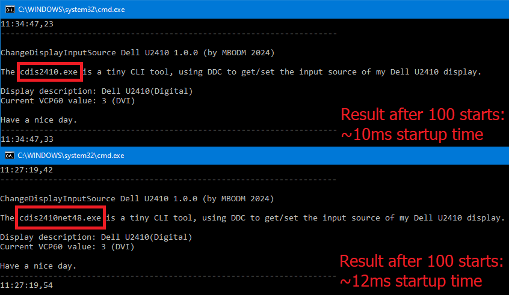

# DotNet8-AOT-StartupPerformanceComparison
A quick startup perfomance comparison between .NET 8 AOT and .NET FX 4.8

### What?

Some .NET Framework 4.8 devs ("*the old farts*" 😉) asked me, if a .NET8 AOT pre-compiled application can really beat a .NET Framework 4.8 runtime/JIT application, when it comes down to startup speed. Cause of the following benefits a .NET Framework 4.8 runtime/JIT application has:

- less complex PE header evaluation
- NGEN performance boost
- caching (repeated starts)
- "hot state of CLR/JIT" vs. "Windows handling of a typical native executable" for every repeated start
- .NET8 native executable *might* load a trimmed-down framework into memory when started (like i.e. pre-compiled Python does)
- the love of god (subjective)

Therefore i quickly tested this, since i was curious too.

### How?

By using the most simple shit: A batch script.

### Results?

See screenshot above.

- .NET8 AOT is indeed "*blazingly fast!*" (also see Nick Chapsas about this, [here](https://www.youtube.com/watch?v=gJcPqdbKF90) on Youtube)
- But most important: Even when .NET8 is just ~2ms faster, .NET8 is **not** slower. Which is, to me, the most important fact.

### Notes

This were just some quick tests on the Windows Command Prompt. **Not** multi-billion dollar rocket science analytics by the NASA!

Just keep this in mind.

#### Have fun.
